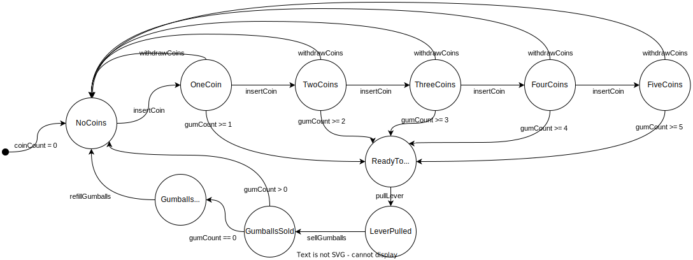

# Диаграмма состояний

Выбрать какой-либо объект по желанию и составить для него диаграмму состояний-переходов.

(Для примера: ввод пин кода в банкомате, вход-авторизация в windows.  Не обязательно должно быть связано с программами.)

